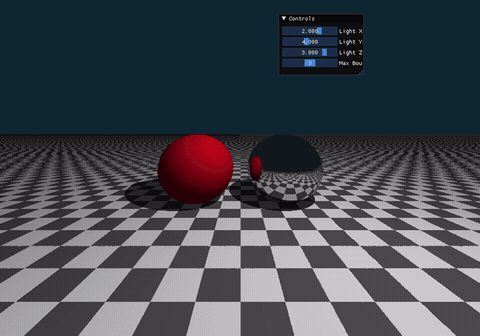
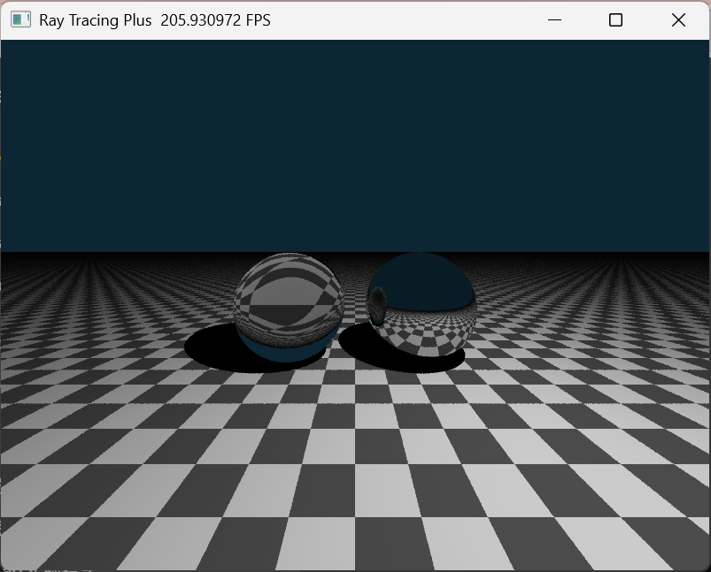

# Taichi Whitted-Style 迭代光线追踪实验
苏文丽202411081022
## 项目简介
基于 Taichi 实现光线追踪(Ray Tracing)，采用迭代循环替代递归适配GPU并行，无外部模型，Kernel内隐式生成几何体，UI滑块实时调节光源坐标与最大弹射次数，实现硬阴影、镜面多级反射效果。

## 实验目标
1. 理解光线投射(Ray Casting)与光线追踪(Ray Tracing)的本质区别
2. 掌握次级射线实现硬阴影、理想镜面反射的全局光照实现方法
3. 掌握GPU友好的迭代式光线追踪编写思路，解决浮点自相交精度问题

## 实验原理
反射向量计算公式：
$$\mathbf{R} = \mathbf{L}_{in} - 2(\mathbf{L}_{in} \cdot \mathbf{N})\mathbf{N}$$
- 阴影射线：交点向光源发射射线，中途相交则当前点处于阴影，仅保留环境光
- 漫反射材质：基于Phong模型计算颜色，光线传播终止
- 镜面材质：计算反射方向生成新射线持续弹射，达到最大次数停止
- 精度修正：射线起点沿法线偏移极小值消除Shadow Acne自相交噪点

## 场景配置
- 物体：y=-1.0棋盘格地面、左侧红色漫反射球、右侧银色镜面球（隐式几何求交，材质ID区分）
- 地面平面：y=-1.0，法线(0, 1, 0)，黑白棋盘格纹理，漫反射材质
- 红色球体：坐标(-1.5, 0.0, 0)，半径1.0，漫反射材质
- 镜面球体：坐标(1.5, 0.0, 0)，半径1.0，纯镜面反射材质
- 光线迭代：使用for循环追踪光线，throughput记录光线衰减系数

## 可调交互参数
| 参数 | 调节范围 | 默认值 |
|------|----------|--------|
| Light X | -5.0 ~ 5.0 | 2.0 |
| Light Y | -5.0 ~ 5.0 | 3.0 |
| Light Z | -5.0 ~ 5.0 | 4.0 |
| Max Bounces | 1 ~ 5 | 3 |

## 环境依赖
- Python 3.8+
- taichi >= 1.4.0

## 渲染演示效果
<p align="center">
  
</p>

##  选做拓展内容（仅供学有余力的同学选做）
### 1 折射玻璃材质实现（加分 +15%）
#### 核心原理：斯涅尔定律 Snell's Law
基于光的折射定律计算透射光线传播方向，将球体替换为透明玻璃材质，同时处理介质边界的全反射现象。
斯涅尔定律公式：
$$
n_1 \sin\theta_1 = n_2 \sin\theta_2
$$
- $n_1$：入射介质折射率（空气 $n_1 \approx 1.0$）
- $n_2$：玻璃介质折射率（玻璃常用 $n_2 \approx 1.52$）
- $\theta_1$：入射光线与法线夹角（入射角）
- $\theta_2$：折射光线与法线夹角（折射角）

#### 实现流程
1. 光线碰撞玻璃球体后，区分介质内外，获取两侧折射率 $n_1、n_2$；
2. 利用入射向量、法向量结合斯涅尔定律求解折射透射光线；
3. 计算临界角，判断是否触发**全反射**：当入射角大于临界角时，不再生成透射光，仅保留反射光线；
4. 同时叠加菲涅尔效应，根据入射角度混合反射光与透射光颜色，还原真实玻璃通透质感。

### 2 MSAA 多重采样抗锯齿（加分 +10%）
#### 问题说明
基础单采样光线追踪仅在像素中心点发射一条主射线，几何体边缘会出现阶梯状像素锯齿，画面观感粗糙。

#### MSAA 实现思路
采用像素内多重随机采样方案平滑边缘：
1. 对每一个渲染像素，在像素方格内生成多组随机亚像素采样点；
2. 每个采样点独立发射一条主射线，分别计算采样点光照颜色；
3. 将当前像素内所有采样得到的颜色取平均值作为该像素最终输出色；
4. 采样数量越高，锯齿消除效果越好，代价为渲染耗时线性上升。


#### 效果特点
无需后期滤镜，从光线采样源头消除走样，物体轮廓边缘过渡柔和自然，是光线追踪场景基础抗锯齿方案。


安装命令：
```bash
pip install taichi
